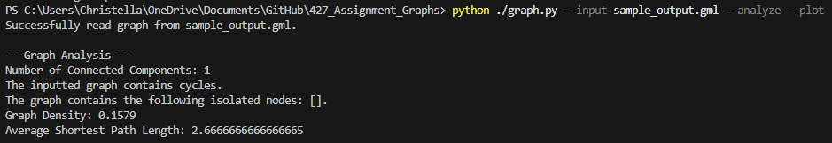

# 427 Assignment Graphs
### Names: Daniel Jose Quizon (030462352) & Christella Marie P. Taguicana (031400952)

## Usage Instructions

Ensure that the 'networkx' and 'matplotlib' modules are installed:
```
pip install networkx matplotlib
```
### Command Line Structure

To generate a random graph, analyze it, plot visualization, and saves to an output file:
```
python ./graph.py [--create_random_graph n c] [--multi_BFS a1 a2 ...] [--analyze] [--plot] [--output out_graph_file_name.gml]    
```

To read an existing file, analyze and plot it:
```
python ./graph.py [--input file.gml] --analyze --plot
```

## Implementation
Our implementation consists of 6 files titled:
```
argument_parser.py
graph_algorithms.py
graph_analysis.py
graph_io.py
graph.py
visualizerBFS.py
```

**argument_parser.py:**
```
This file parses the command line arguments to process and analyze the graph. We added the specific arguments (i.e. --input, --create_random_graph, etc.) using the 'argparse' module.
```

**graph_algorithms.py:**
```
- This file includes all the algorithms that would perform Breadth-First Search (BFS) and identify/calculate the connected components, cycles, and isolated nodes in the graph. 
- The function multi_BFS(graph, startNodes) performs BFS after accepting one or more nodes, either from a pre-defined graph or when creating a new one. If nodes cannot be found, they are handled by skipping it gracefully. We used dictionaries to store the distances and parents for the BFS to refer back to it later on. The suffix section creates a unique identifier for each BFS run so that they are stored separately.
- The function connectedComp(graph) identifies the connected components in the graph. Using the 'networkx' module, a list is created for the connected components.  When the code runs, the nuumber of connected components is returned.
The function findCycles(graph, num_components) using nx._is_forest from the 'networkx' module. If not nx.is_forest(graph), that means a cycle exists in the graph. 
- The function isolated_nodes(graph) uses the nx.isolates(graph) function to create a list of the isolated nodes and return them.
```

**graph_analysis.py:**
```
- This file contains the functions graph_density(graph) and avgShortestPath(graph). 
- graph_density(graph) calculates the density of the graph by calculating the maximum possible number of edges. Then, it divides the actual number of edges by the maximum possible number of edges. If the density is less than 1.0, then the graph is either not connected (0.0) or very sparse.
- avgShortestPath(graph) calculates the shortest path length for the generated or given graph using the nx.average_shortest_path_length(graph) function if the graph is connected.
```

**graph_io.py:**
```
- This file reads and writes files.
- readGraph(file_path): It attempts to read a file, and if the file cannot be found, an error message shows up.
- writeGraph(graph, file_path): creates the .gml file, writes nodes, attributes, and edges, and saves the graph. An appropriate error message is displayed if writing the output file is unsuccessful.
```

**graph.py**
```
This is the main driver of the program.

- The code generates a random graph using Erdos-Renyi if the command-line prompt instructs it to do so. If the program is reading a graph, a message will be displayed to continue running the program. If not, errors are handled gracefully.
- If args.multi_BFS is called, then the multi_BFS function is called to run. The same logic applies to args.analyze (analyzes graph), args.plot (plots graph), and args.output (writes graph to an output .gml file).
```

**visualizerBFS.py**
```
- This file plots the graph that was read. 
- plotBFStreeDetailed(graph, bfs_start_nodes): finds the start node and builds the BFS tree, while also recording depths. Then, it also lays out the nodes in a depth-based layout. The tree is drawn, while being provided appropriate colors for visibility. Each BFS path is then highlighted as BFS is performed from the start node. The start node is highlighted for clarity, and the levels/layers are labeled.

- plotBFStreeMinimalist(graph, bfs_start_nodes): builds the BFS tree from main start node. This is similar to the detailed graph, but is more tailored for graphs with less nodes.

- plotBFStree(graph, bfs_start_nodes): calls the designated function depending on the number of nodes that are being read.
```

## Examples of commands and outputs provided
1. **To read and plot a pre-defined graph (sample_output.gml):**
    python ./graph.py --input sample_output.gml --analyze --plot

    **Visual Output:** 
    **Analysis Output:** 

2. **Creating a random graph:**
    python ./graph.py --input sample_output.gml --analyze --plot

    **Visual Output:** 
    **Analysis Output:** 